# team39 - Amigo

## Purpose:
Canada is the land of immigrants.  The newcomers don’t have contacts when they arrive and as a result, have difficulty finding roommates to stay at shared rentals at affordable pricing. This issue is faced by professionals and students alike.  We aim to simplify the process of finding roommates.

## Usage & Current Functionality:

### Homepage - https://dry-spire-46880.herokuapp.com/
The home page displays information and acts as the landing page for our project. On the homepage, you can click the posting button on the navbar to view the posting page, login button to login in as an admin or an user, dashboard button for viewing your dashboard once logged in. 


### Login and Register View - https://dry-spire-46880.herokuapp.com/login
The login page is easily accessible from the navbar. It has functionality for logging in and registering a new account. Upon entering the correct credentials, the user is redirected to user dashboard and the admin is redirected to the admin dashboard. 

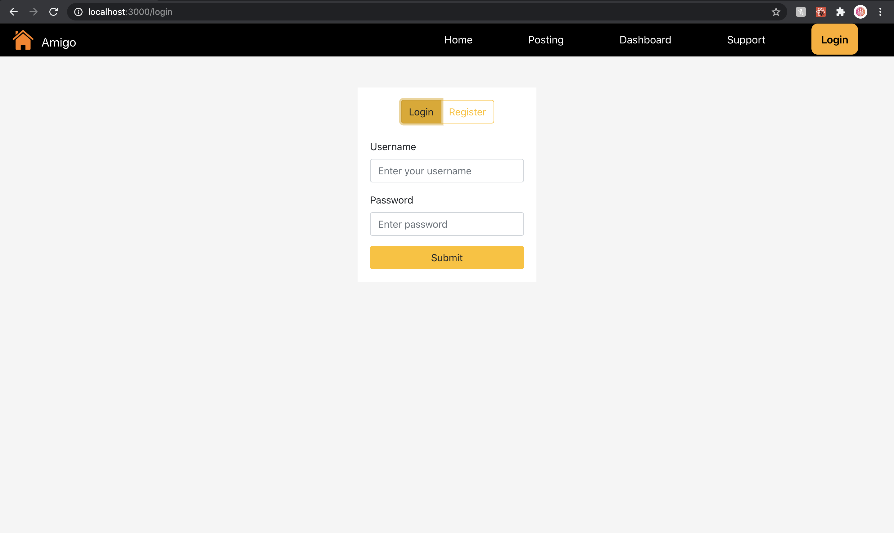 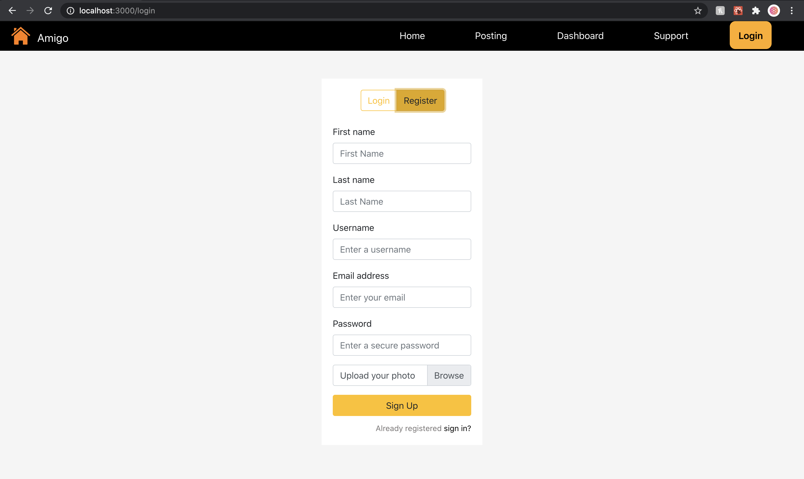

### Admin Dashboard View - https://dry-spire-46880.herokuapp.com/admindashboard
<ins>username</ins>: admin

<ins>password</ins>: admin

Once logged in as admin, you will be able to view the admin dashboard. When you click the dashboard button on the Navbar you will be taken to the admin dashboard page. This page allows you to see all users under User Management and all posts under Post Management. You can switch between both User Mangement and Post Management by clicking on their respective button. Reported users and reported posts will appear with a large red flag. You will be able to edit and delete any post and user as an admin. 

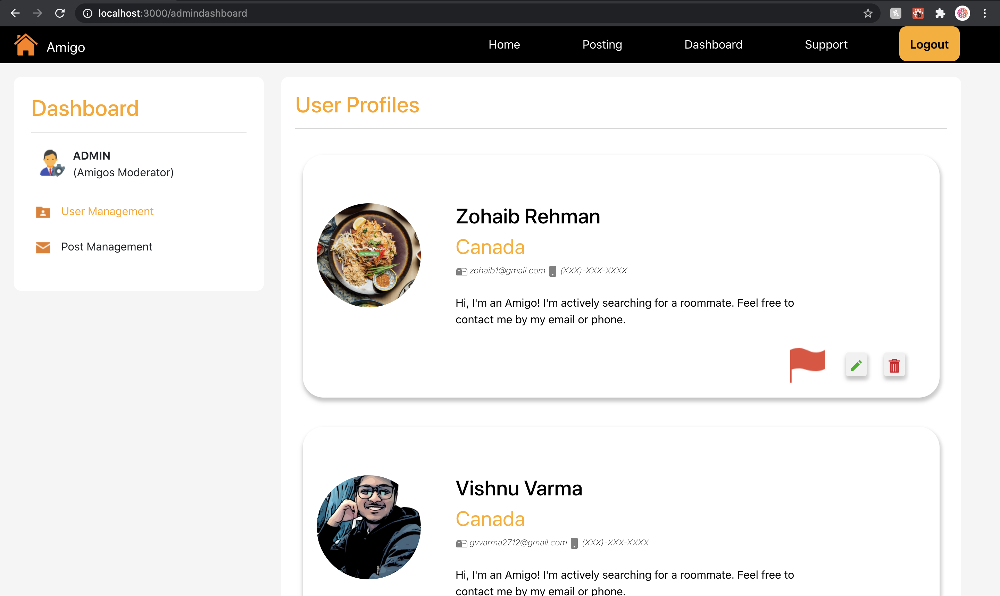 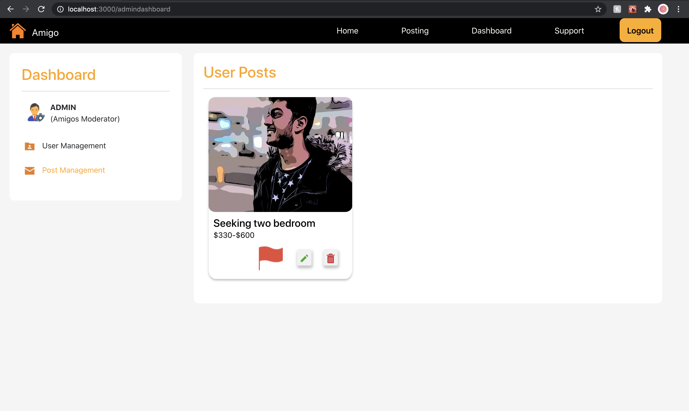

### User Dashboard View - https://dry-spire-46880.herokuapp.com/userdashboard

Users:

<ins>username</ins>: user
<ins>password</ins>: user

<ins>username</ins>: user1
<ins>password</ins>: user1

<ins>username</ins>: user2
<ins>password</ins>: user2

<ins>username</ins>: user3
<ins>password</ins>: user3

Once logged in as a user, you will be able to view the user dashboard. When you click the dashboard button on the Navbar you will be taken to the user dashboard page. Here, you will be able to see all the posts made by the user ( that is you ). You will be able to view, edit and delete your own post under User Activity. Clicking on View Profile next to the Profile image takes you to your Profile Page. You will be able to edit your profile information as well as password under Settings.

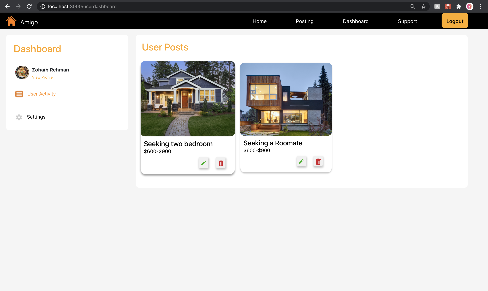

### Postings View - https://dry-spire-46880.herokuapp.com/finder
Here, you will be able to view all the postings made on Amigo. You will be able to filter based on preferences, location and price. You can switch between the **Map View** and **Postings View** by clicking on the map/list button on the Postings Page. Once logged in as a user, you will be able to make a post.


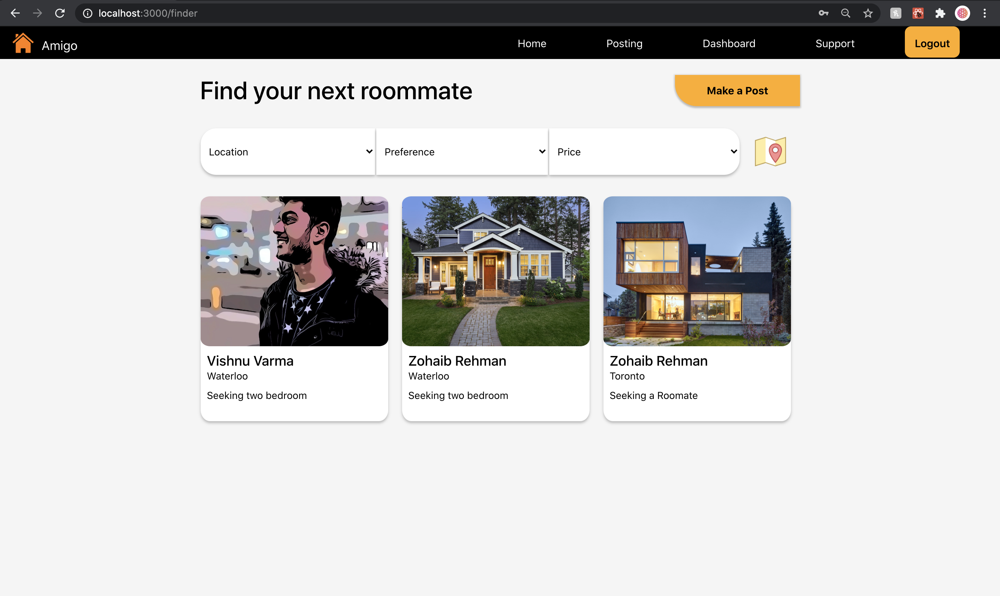   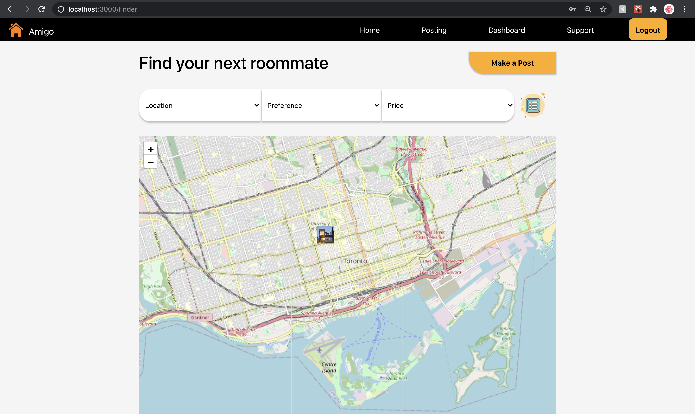

### Make a New Post View - https://dry-spire-46880.herokuapp.com/makepost
Once logged in as a user you will be able to create a post by clicking on Make a Post on the postings page. 

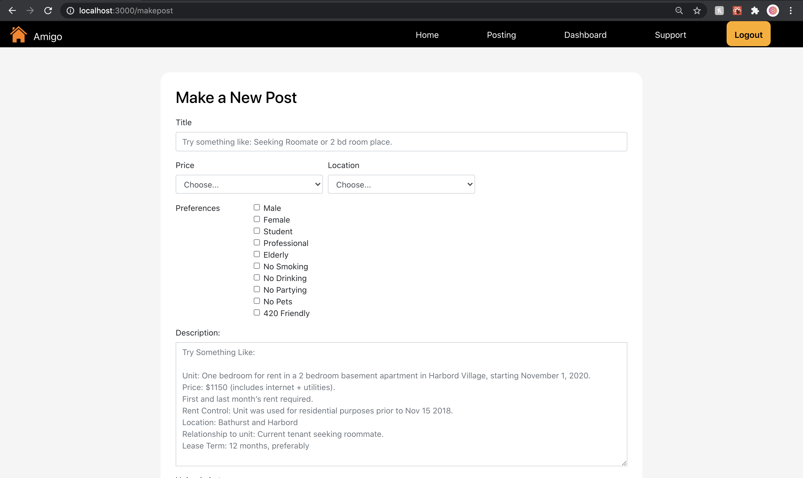

### Post View - https://dry-spire-46880.herokuapp.com/post/<:postid>
Once you click on a post in postings page, you will be taken to another page with post details and ability to contact the user who made the post by filling the form, which will prefill email with information based on your form input with the post creator's email as the sender. 

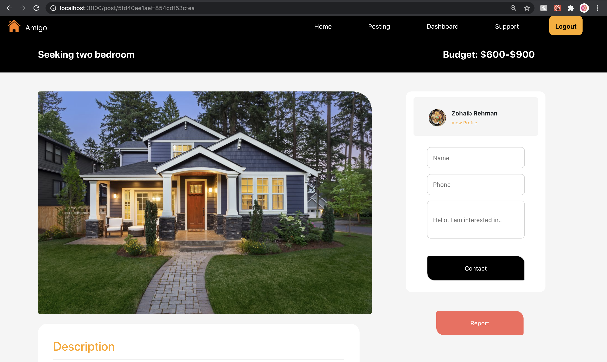

### Edit Post View - https://dry-spire-46880.herokuapp.com/editpost/<:userid>
As an admin or as the post creator user, you will be able to edit the post in this form.

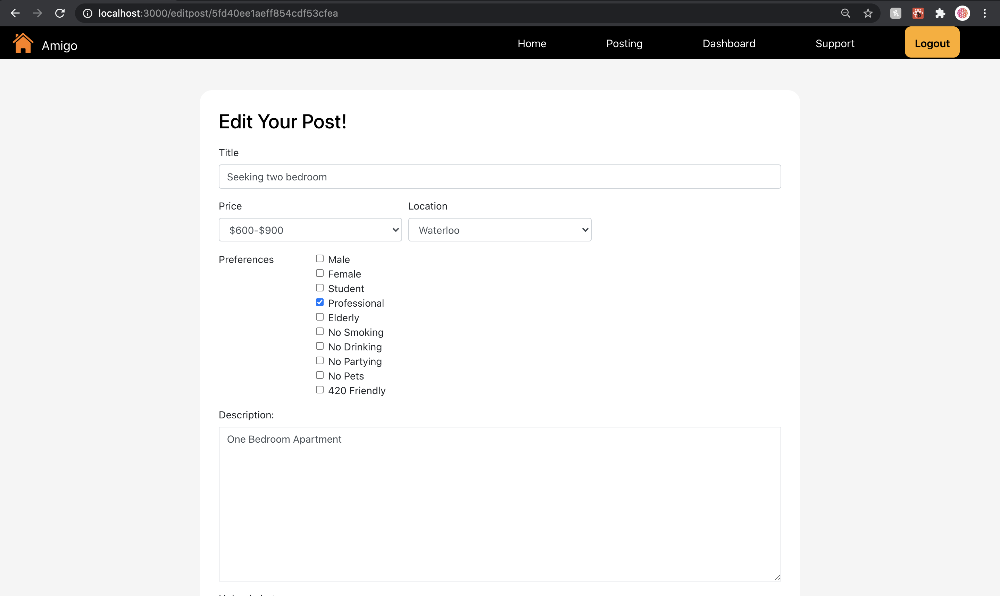

### Profile Page View - https://dry-spire-46880.herokuapp.com/user/<:userid>
You can view profile by clicking on View Profile link for a user. 

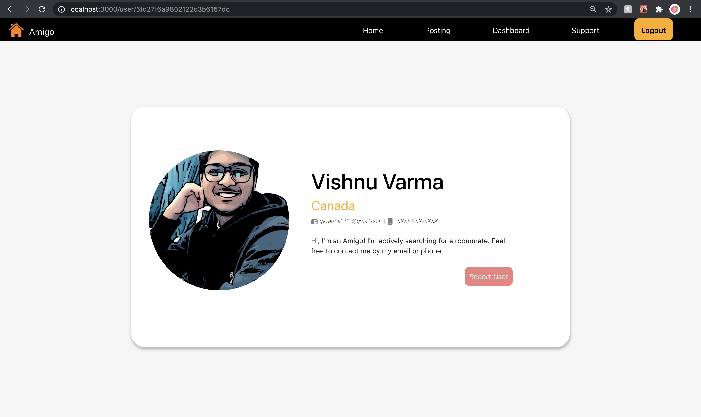


### Edit Profile View - https://dry-spire-46880.herokuapp.com/edituser/<:userid>
As an admin or as the user, you will be able to edit your respective profile and password in this form.

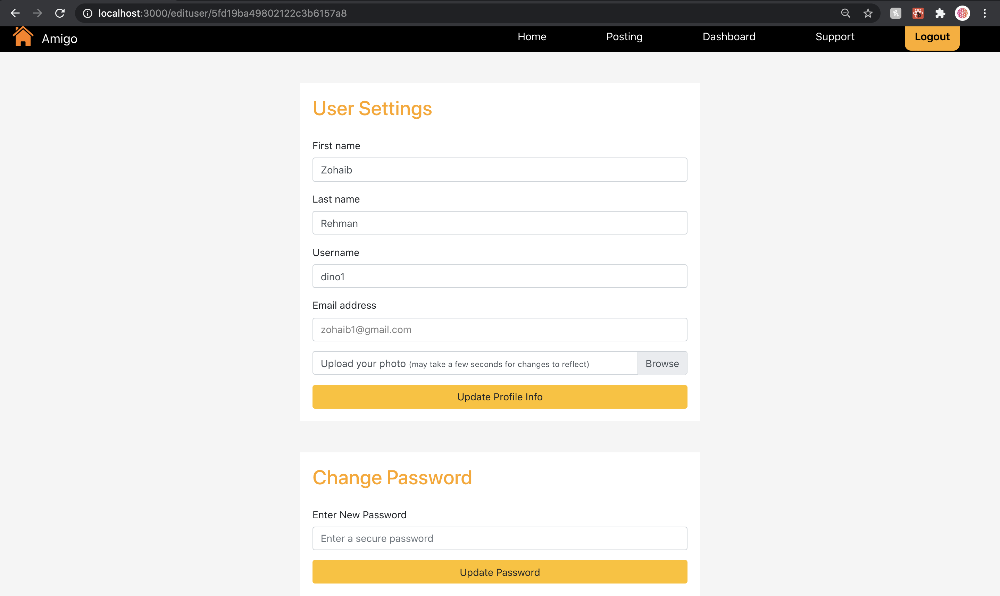


#### Note:
Authentication is added to secure views and editing/deleting  posts and users. 


## API Documentation

If testing on deployed website then:
```
Base URL = https://dry-spire-46880.herokuapp.com/
```
Otherwise, if testing on localhost then:
```
Base URL = http://localhost:5000
```
The base URL will precede all the routes listed below.


### Routes

```
POST /api/users/login

Purpose: Logging in a user

Expected Type: raw JSON

Expected Data: {
    "username": "user"
    "password": "user"
}

Returns: {
    "currentUser": "user"
}
```

```
POST /api/users/new

Purpose: Creating a new user

Expected Type: form-data

Expected Data:

| key       | type | value            |
|-----------|------|------------------|
| image     | File | profilePhoto.jpg |
| username  | Text | user             |
| email     | Text | user@mail.com    |
| firstName | Text | Zohaib           |
| lastName  | Text | Rehman           |
| password  | Text | user             |

Returns: the mongodb document of the newly created user
```
```
POST /api/create-admin

Purpose : Initialises an admin with username of admin and password of admin.

No expected data

Returns: mongodb document of the created admin
```
```
POST /api/posts/new

Purpose: Creating a new post

Authorization: need to be logged in as a user

Expected Type: form-data

Expected Data:

| key         | type       | value                                         |
|-------------|------------|-----------------------------------------------|
| image       | File       | housePhoto.jpg                                |
| title       | Text       | Seeking two roommates                         |
| location    | Text       | Waterloo                                      |
| price       | Text       | $330-$600                                     |
| description | Text       | Let's look for a nice place close to campus.  |
| preferences | List[Text] | ["No Smoking", "No Drinking"]                 |

- location should be one of the following cities: [Toronto, Waterloo, London, Vancouver, Ottawa, Montreal, Mississauga, "Scarborough]

- price should be one of the the following ranges: [$0-$300, $330-$600, $600-$900, $900-$1200, $1200-$1500, $1500-$2000, $2000-$3000, $3000+]

- preferences should be a subset of [Male, Female Student, Professional, Elderly, No Smoking, No Drinking, No Partying, No Pets, 420 Friendly]

Returns: mongodb document of the newly created post
```
```
POST /api/posts/:id/report

Purpose: Reporting an innaproriate post

Authorization: need to be logged in as a user or admin

Expects a valid post id in the url

Returns: updated post document where the flagged parameter will be true
```
```
POST /api/users/:id/report

Purpose: Reporting an innaproriate user

Authorization: need to be logged in as a user or admin

Expects valid id in the url

Returns: updated user document where the flagged parameter will be true
```
```
PUT /api/users/:id

Purpose: Updating user information

Expected Type: raw JSON

Expected Data: {
    "username": "user",
    "email": "user@mail.com",
    "firstName": "Zohaib",
    "lastName": "Rehman"
}

Returns: updated user document
```
```
PUT /api/users/:id/password

Purpose: Updating user password

Authorization: need to be logged in as the user with user _id = id

Expected Type: raw JSON

Expected Data: {
    "password": "dino123"
}

Returns: updated user document where the password parameter will be the updated password
```
```
PUT /api/users/:id/img

Purpose: Updating user profile photo

Authorization: need to be logged in as as the user with user _id = id

Expected Type: form-data

Expected Data: 

| key         | type | value                                         |
|-------------|------|-----------------------------------------------|
| image       | File | newUserPhoto.jpg                              |

Returns: updated user document
```
```
PUT /api/posts/:id

Purpose: Updating post information

Authorization: need to be logged in as as the creator of the post with _id = id or as admin

Expected Type: raw JSON

Expected Data: a valid post id is needed in the url

{
    "title": "Seeking four bedroom house",
    "location": "Waterloo",
    "price": "$1200-$1500",
    "preferences": ["No smoking", "No drinking"],
    "description": "Looking for two friendly university students. If this sounds like you then hit me up. Looking forward to meeting you amigo! :)"
}

- location should be one of the following cities: [Toronto, Waterloo, London, Vancouver, Ottawa, Montreal, Mississauga, "Scarborough]

- price should be one of the the following ranges: [$0-$300, $330-$600, $600-$900, $900-$1200, $1200-$1500, $1500-$2000, $2000-$3000, $3000+]

- preferences should be a subset of [Male, Female Student, Professional, Elderly, No Smoking, No Drinking, No Partying, No Pets, 420 Friendly]

Returns: updated post document
```
```
PUT /api/posts/:id/img

Purpose: Updating post image

Authorization: need to be logged in as as the creator of the post with _id = id or as admin

Expected Type: form-data

Expected Data:

| key         | type       | value                                         |
|-------------|------------|-----------------------------------------------|
| image       | File       | newPostPhoto.jpg                              |
```
```
GET /api/users/logout

Purpose: Logging out a user

Expects a logged in session to exist.
Will Destroy this session and send a 200 status code.
```
```
GET /api/posts

Purpose: Retrieving post information of all posts

Returns: post document of all the posts
```
```
GET /api/users/:id

Purpose: Retrieving a particular user's information

Expected Type: raw JSON

Returns: user document of the user with user's _id = id
```
```
GET /api/users

Purpose: Retrieving user information of all users

Expected Type: raw JSON

Returns: user document of all the users
```
```
GET /api/posts/:id

Purpose: Retrieing post information of a particular post

Expected Type: raw JSON

Returns: post document of the post where post's _id = id
```
```
GET /api/users/check-session

Purpose: Checking is user's session still exists

Expected Type: raw JSON

Returns: {
    "currentUser": "user",
    "currentUserId": "5fd3e4a6772ba1148ab9f355" (this is mongodb ObjectId)
}

```


### Install dependencies and run on your local machine

React, NodeJS and MongoDB database should be installed on your machine.
Clone the project onto your local machine.
```bash=1
git clone https://github.com/csc309-fall-2020/team39.git
```

Install all the npm packages. Go into the project folder and install all npm packages:

```bash=2
cd team39
npm install
cd client/
npm install
cd ../
```

To run the application:

```bash=7
mkdir mongo-data
mongod --dbpath mongo-data
npm start
cd client/
npm start
```

The application runs on **localhost:3000** on your local machine. The server runs on **localhost:5000** on your local machine.

## Repository Map

```bash
.
└── team39
    ├── README.md
    ├── client
    │   ├── README.md
    │   ├── package-lock.json
    │   ├── package.json
    │   ├── public
    │   │   ├── favicon.ico
    │   │   ├── index.html
    │   │   ├── logo.svg
    │   │   ├── logo192.png
    │   │   ├── logo512.png
    │   │   ├── manifest.json
    │   │   └── robots.txt
    │   └── src
    │       ├── App.css
    │       ├── App.js
    │       ├── App.test.js
    │       ├── actions
    │       │   ├── admin.js
    │       │   ├── post.js
    │       │   └── user.js
    │       ├── assets
    │       │   ├── admin-icon.png
    │       │   ├── dashboard-icon.png
    │       │   ├── delete-icon.svg
    │       │   ├── delete.png
    │       │   ├── edit-icon.svg
    │       │   ├── edit.png
    │       │   ├── flagged.png
    │       │   ├── houseBanner.jpg
    │       │   ├── interior-1.jpg
    │       │   ├── list-icon.png
    │       │   ├── logo.svg
    │       │   ├── mailicon.svg
    │       │   ├── map-icon.png
    │       │   ├── motto.jpg
    │       │   ├── phoneicon.svg
    │       │   ├── post-management.png
    │       │   ├── potrait2.jpg
    │       │   ├── potrait3.jpg
    │       │   ├── potrait4.png
    │       │   ├── settings.png
    │       │   ├── user-activity.png
    │       │   └── user-management.png
    │       ├── components
    │       │   ├── Navbar
    │       │   │   ├── Navbar.css
    │       │   │   └── Navbar.jsx
    │       │   ├── UserCard
    │       │   │   ├── UserCard.css
    │       │   │   └── UserCard.jsx
    │       │   ├── dashboardPageComponents
    │       │   │   ├── NotificationPanel
    │       │   │   │   ├── NotificationPanel.css
    │       │   │   │   ├── NotificationPanel.jsx
    │       │   │   │   └── PostNotification
    │       │   │   │       ├── EditPost
    │       │   │   │       │   ├── EditPost.css
    │       │   │   │       │   └── EditPost.jsx
    │       │   │   │       ├── PostNotification.css
    │       │   │   │       └── PostNotification.jsx
    │       │   │   ├── PostManagement
    │       │   │   │   ├── PostManagement.css
    │       │   │   │   ├── PostManagement.jsx
    │       │   │   │   └── Posts
    │       │   │   │       ├── Posts.css
    │       │   │   │       └── Posts.jsx
    │       │   │   ├── UserManagement
    │       │   │   │   ├── UserManagement.css
    │       │   │   │   ├── UserManagement.jsx
    │       │   │   │   └── Users
    │       │   │   │       ├── Users.css
    │       │   │   │       └── Users.jsx
    │       │   │   ├── UserPanel
    │       │   │   │   ├── UserFunctionality
    │       │   │   │   │   ├── UserFunctionality.css
    │       │   │   │   │   └── UserFunctionality.jsx
    │       │   │   │   ├── UserPanel.css
    │       │   │   │   ├── UserPanel.jsx
    │       │   │   │   └── UserProfile
    │       │   │   │       ├── UserProfile.css
    │       │   │   │       └── UserProfile.jsx
    │       │   │   └── index.js
    │       │   ├── editPostComponent
    │       │   │   ├── EditPost.jsx
    │       │   │   └── MakePost.css
    │       │   ├── editProfileComponents
    │       │   │   ├── EditPassword.jsx
    │       │   │   ├── EditProfile.css
    │       │   │   └── EditProfile.jsx
    │       │   ├── finderPageComponents
    │       │   │   ├── Filter
    │       │   │   │   ├── Filter.css
    │       │   │   │   └── Filter.jsx
    │       │   │   ├── MapFinder
    │       │   │   │   ├── MapFinder.css
    │       │   │   │   └── MapFinder.jsx
    │       │   │   ├── Pagination
    │       │   │   │   ├── Pagination.css
    │       │   │   │   └── Pagination.jsx
    │       │   │   ├── Post
    │       │   │   │   ├── Post.css
    │       │   │   │   └── Post.jsx
    │       │   │   ├── Posts
    │       │   │   │   ├── Posts.css
    │       │   │   │   └── Posts.jsx
    │       │   │   └── index.js
    │       │   ├── landingPageComponents
    │       │   │   ├── bannerComponent
    │       │   │   │   ├── Banner.css
    │       │   │   │   └── Banner.jsx
    │       │   │   ├── index.js
    │       │   │   ├── mottoComponent
    │       │   │   │   ├── Motto.css
    │       │   │   │   ├── Motto.jsx
    │       │   │   │   └── MottoText.jsx
    │       │   │   └── reviewsComponent
    │       │   │       ├── Review.css
    │       │   │       ├── Review.jsx
    │       │   │       └── Reviews.jsx
    │       │   ├── loginPageComponents
    │       │   │   ├── loginComponent
    │       │   │   │   ├── Login.css
    │       │   │   │   └── Login.jsx
    │       │   │   └── signUpComponent
    │       │   │       ├── SignUp.css
    │       │   │       └── SignUp.jsx
    │       │   ├── makePostPageComponents
    │       │   │   └── MakePost
    │       │   │       ├── MakePost.css
    │       │   │       └── MakePost.jsx
    │       │   ├── postPageComponents
    │       │   │   ├── PostDescription
    │       │   │   │   ├── PostDescription.css
    │       │   │   │   └── PostDescription.jsx
    │       │   │   ├── PostHeader
    │       │   │   │   ├── PostHeader.css
    │       │   │   │   └── PostHeader.jsx
    │       │   │   ├── PostImage
    │       │   │   │   ├── PostImage.css
    │       │   │   │   └── PostImage.jsx
    │       │   │   ├── PostOwnerForm
    │       │   │   │   ├── PostOwnerForm.css
    │       │   │   │   ├── PostOwnerForm.jsx
    │       │   │   │   └── PostOwnerProfile
    │       │   │   │       ├── PostOwnerProfile.css
    │       │   │   │       └── PostOwnerProfile.jsx
    │       │   │   ├── PostRequirement
    │       │   │   │   ├── PostRequirement.css
    │       │   │   │   └── PostRequirement.jsx
    │       │   │   └── index.js
    │       │   └── userDashboardPageComponents
    │       │       ├── NotificationPanel
    │       │       │   ├── NotificationPanel.css
    │       │       │   ├── NotificationPanel.jsx
    │       │       │   └── PostNotification
    │       │       │       ├── EditPost
    │       │       │       │   ├── EditPost.css
    │       │       │       │   └── EditPost.jsx
    │       │       │       ├── PostNotification.css
    │       │       │       └── PostNotification.jsx
    │       │       ├── UserActivity
    │       │       │   ├── UserActivity.css
    │       │       │   ├── UserActivity.jsx
    │       │       │   └── UserActivityPost
    │       │       │       ├── UserActivityPost.css
    │       │       │       └── UserActivityPost.jsx
    │       │       ├── UserPanel
    │       │       │   ├── UserFunctionality
    │       │       │   │   ├── UserFunctionality.css
    │       │       │   │   └── UserFunctionality.jsx
    │       │       │   ├── UserPanel.css
    │       │       │   ├── UserPanel.jsx
    │       │       │   └── UserProfile
    │       │       │       ├── UserProfile.css
    │       │       │       └── UserProfile.jsx
    │       │       └── index.js
    │       ├── index.css
    │       ├── index.js
    │       ├── logo.svg
    │       ├── reportWebVitals.js
    │       ├── setupTests.js
    │       └── views
    │           ├── DashboardPage
    │           │   ├── DashboardPage.css
    │           │   └── DashboardPage.jsx
    │           ├── EditPostPage
    │           │   ├── EditPostPage.css
    │           │   └── EditPostPage.jsx
    │           ├── EditProfilePage
    │           │   ├── EditProfilePage.css
    │           │   └── EditProfilePage.jsx
    │           ├── FinderPage
    │           │   ├── FinderPage.css
    │           │   └── FinderPage.jsx
    │           ├── LandingPage
    │           │   ├── LandingPage.css
    │           │   └── LandingPage.jsx
    │           ├── LoginPage
    │           │   ├── LoginPage.css
    │           │   └── LoginPage.jsx
    │           ├── MakePostPage
    │           │   ├── MakePostPage.css
    │           │   └── MakePostPage.jsx
    │           ├── PostPage
    │           │   ├── PostPage.css
    │           │   └── PostPage.jsx
    │           ├── UserDashboardPage
    │           │   ├── UserDashboardPage.css
    │           │   └── UserDashboardPage.jsx
    │           ├── UserPage
    │           │   ├── UserPage.css
    │           │   └── UserPage.jsx
    │           └── index.js
    ├── db
    │   └── mongoose.js
    ├── models
    │   ├── admin.js
    │   ├── user.js
    │   └── userPost.js
    ├── package-lock.json
    ├── package.json
    ├── screenshots
    │   ├── admindashboard1.png
    │   ├── admindashboard2.png
    │   ├── editpost.png
    │   ├── editprofile.png
    │   ├── finder1.png
    │   ├── finder2.png
    │   ├── homepage.png
    │   ├── login.png
    │   ├── makepost.png
    │   ├── postpage.png
    │   ├── register.png
    │   ├── userdashboard.png
    │   └── userprofile.png
    └── server.js

67 directories, 171 files
```

## External Libraries Used:
- React
- Leafleft (Maps)
- bcryptjs
- cloudinary
- Bootstrap 4 (Very limited use. Only used for fonts and login page.)

**The pictures are taken from prexel which are free for commercial use and no attribution is required. The icons are taken from Icons8.**
