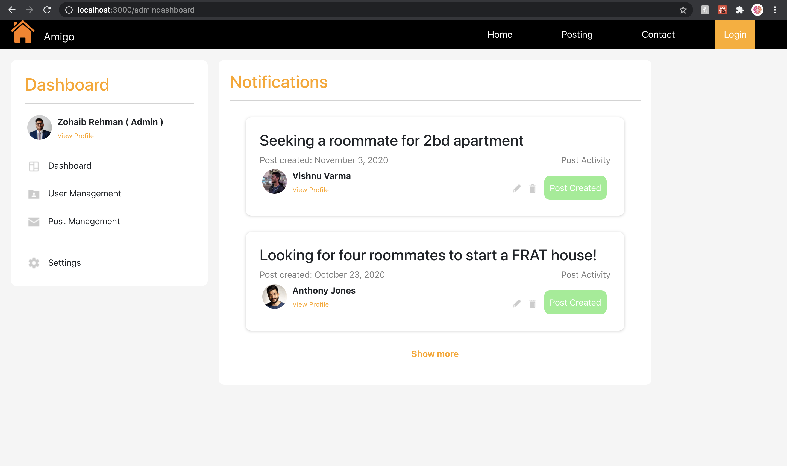
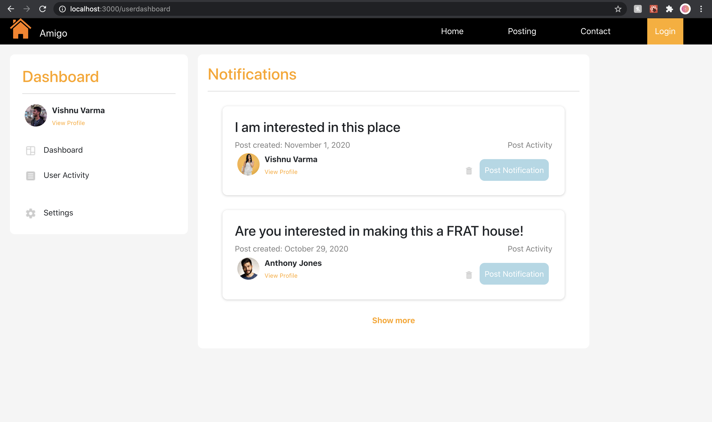
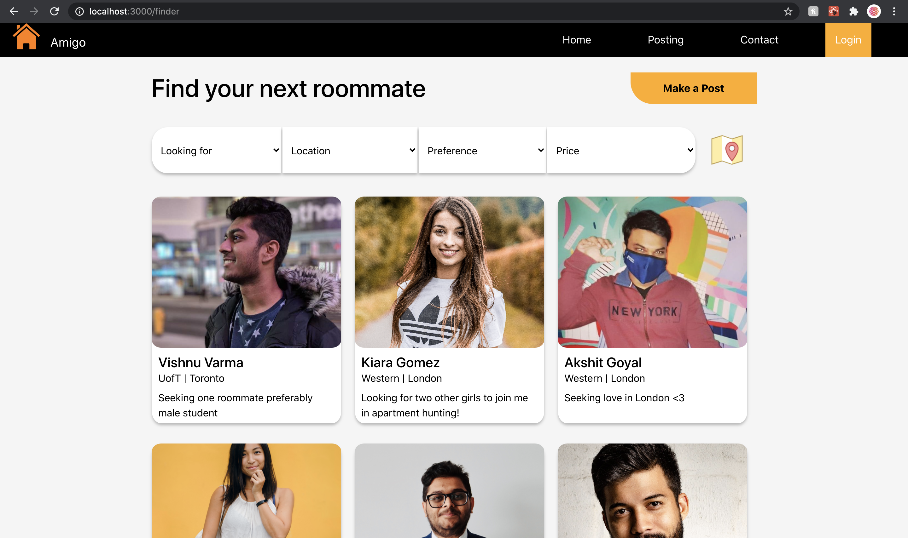
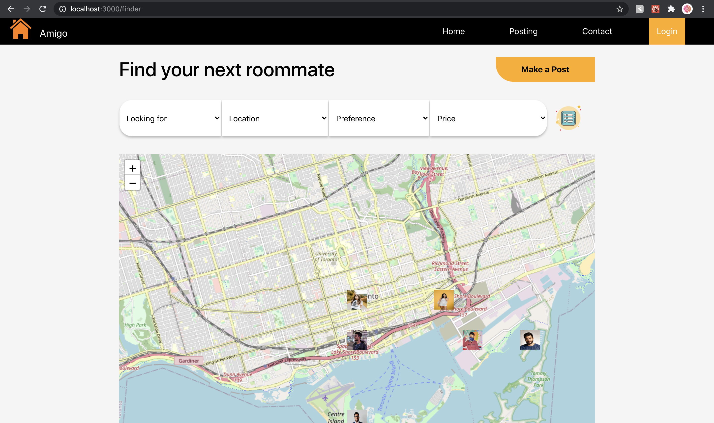
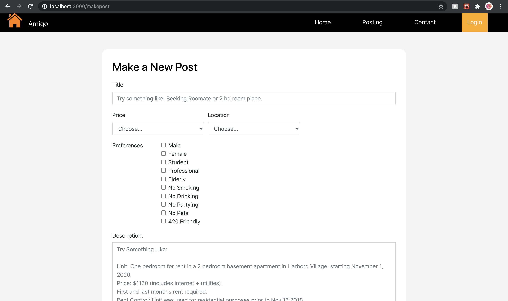
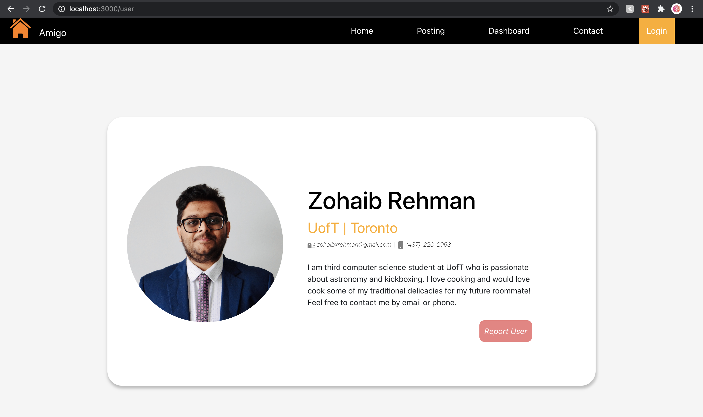
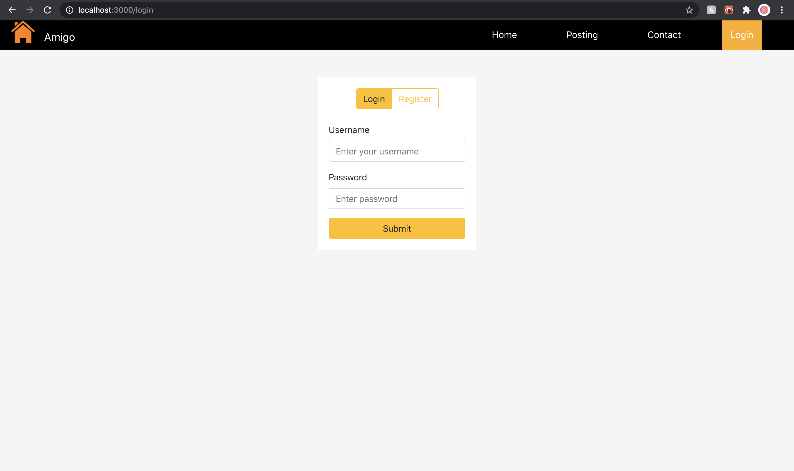

# team39 - Amigo

## Purpose:
Canada is the land of immigrants.  The newcomers don’t have contacts when they arrive and as a result, have difficulty finding roommates to stay at shared rentals at affordable pricing. This issue is faced by professionals and students alike.  We aim to simplify the process of finding roommates.

## Usage & Current Functionality:

### Homepage - http://localhost:3000
The home page displays information and acts as the landing page for our project. On the homepage, you can click the posting button on the navbar to view the posting page and login button to login in as an admin or an user. 


### Admin Dashboard View - http://localhost:3000/admindashboard
<ins>username</ins>: admin

<ins>password</ins>: admin

Once logged in as admin, you will be redirected to the admin dashboard. This page allows you to see recent activity by all users - like reported users, reported posts, new posts created, and so on. You will be able to edit and delete any post and also delete any users as an admin once the backend is set up. Also, other functionality like user management and post management will be handled once the backend is set up. 



### User Dashboard View - http://localhost:3000/userdashboard
<ins>username</ins>: user

<ins>password</ins>: user

Once logged in as user, you will be taken to the user dashboard. Here, you will be able to see recent notifications received from users who are interested in being your roommates. You will be able to view and edit your own post once the backend is set up, under User Activity.



### Postings View - http://localhost:3000/finder
We plan on having filtering functionality based on preferences, price and location once we have our backend setup. You can switch between the **Map View** and **Postings View** by clicking on the map/list button on the Postings Page. 


   

### Make a New Post View - http://localhost:3000/makepost
As a user you will be able to create a post by clicking on Make a Post on the postings page. 



### Post View - http://localhost:3000/post
Once you click on a post, you will be taken to another page with post details and ability to contact the user who made the post. 


### Profile Page View - http://localhost:3000/user
Note: You can view profile by clicking on View Profile link for any user. 

We are also collecting information from forms (such as make a post, filter, login, contact) and storing it in a react state. When server functionality will be added, this same react state object will be sent to the server and no extra work will be needed.



### Login and Register View** - http://localhost:3000/login
The login page is easily accessible from the navbar. It has functionality for logging in and registering a new account. Upon entering the correct credentials, the user is redirected to user dashboard and the admin is redirected to the admin dashboard. 



## Upcoming Features:
Users view housing/roommate posts and filter based on preferences.

Authentication will be added to secure certain views.

Logged in users will be able to create a new post and view their dashboard.

Currently, a template is shown upon clicking View Profile and clicking on a Post. In the future, users will be able to view other user’s profiles who have created a post or contacted them. This data will be received from the database.

A user can report posts to the admin which they deem inappropriate.

Integration with Maps. This will help the user to filter out roommates according to their locations of interest.

Users can see their own posts in dashboard.

### Install dependencies and run

Clone the project onto your local machine.
```bash
git clone https://github.com/csc309-fall-2020/team39.git
```

Install all the npm packages. Go into the project folder and install all npm packages:

```bash
cd team39/amigo/
npm install
```

To run the application:

```bash
npm start
```

The application runs on **localhost:3000** on your local machine.

## External Libraries Used:
React

Leafleft (Maps)

Bootstrap 4 (Very limited use. Only used for fonts and login page.)

**The pictures are taken from prexel which are free for commercial use and no attribution is required. The icons are taken from Icons8.**
